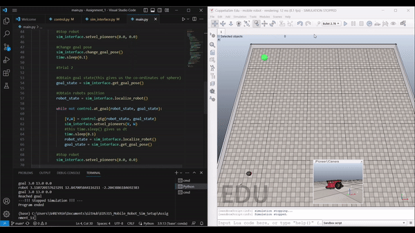
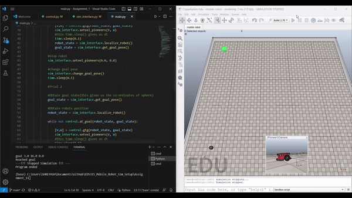

# ED5315 Assignment-1
Waypoint control of a mobile robot(differential drive) in Coppleiasim(V-REP)

## Setup:
OS: Windows 10/11; Ubuntu 20.04; Mac

Python: 3.6.x
Coppeliasim: V4.3.0

To check the compatibility of your system, follow the instructions [here](https://github.com/BijoSebastian/ED5315_Mobile_Robot_Sim_Setup/tree/main/Demo) and run the demo script.

## Instructions:

  1. Download the setup provided in this repository. If you are familiar with how to use git on windows do that, if not click on the green button that says code and click on download zip. Once the download is complete, double click to extract the contents and place them in a location of your choice, the downloads folder itself works fine.

  2. Complete the **gtg function** (go to goal) in the file **control.py**.

  Read through the **control.py** file and implement **PD controller** for **angular velocity**, and **P controller** for **linear velocity**. 
  
  To get the pseudo code for waypoint control read the lecture slides from .

  3. Once you have completed the go to goal implementation(**gtg function**), launch Coppeliasim, open the provided [scenario](). Click on File->Open Scene. Navigate to the downloaded setup and select the file “mobile robot.ttt”. Run the simulation by clicking on the light blue play button.

  4. Launch Spyder. Click on File -> Open and navigate to the downloaded setup. Select the file main.py, run it by clicking on the green play button.(Always ensure you are in the same repository!) 

  5. Always ensure that the simulation is running before you launch the code, otherwise you will get an error that says **"Failed connecting to the remote API server. Program ended"**.

  6.	If your implementation of the gtg function(goal to goal) is correct, you will see robot moving to the position of green blob(which is goal). To check for robustness of your implementation, the goal/green blob will spawn again.(Thus implementation is checked for two random goals!)

7. **Instructions for uploading solution**:	You need to add these *three* files in a zip folder and upload it to moodle: 
    - Upload  **only** the completed **control.py** file.(Do not make any changes to other files)
    - A writeup/report about the controller that you implemented.
    - Take a screen recording of the coppeliasim screen and IDE side by side as shown in solution video below.

## Solution video:
The goal pose moves randomly every time a new instance in launched.

