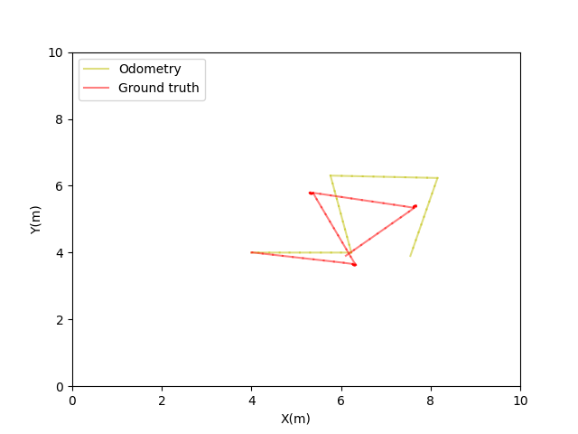

# ED5315 Assignment-1
Impliment odometry for a mobile robot(differential drive) in Coppleiasim(V-REP)

## Setup:
OS: Windows 10/11; Ubuntu 20.04

Python: 3.6.x
Coppeliasim: V4.3.0

To check the compatibility of your system, follow the instructions [here](https://github.com/BijoSebastian/ED5315_Mobile_Robot_Sim_Setup/tree/main/Demo) and run the demo script.

## Instructions:

  1. Download the setup provided in this repository. If you are familiar with how to use git on windows do that, if not click on the green button that says code and click on download zip. Once the download is complete, double click to extract the contents and place them in a location of your choice, the downloads folder itself works fine.

  2. Complete the file **robot_model.py**. Do not make any changes to the other code files provided to you.

  3. Once you have completed the implementation of **simulate function** in robot_model.py, launch Coppeliasim. Click on File->Open Scene. Navigate to the downloaded setup and select the file “mobile robot.ttt”. Run the simulation by clicking on the light blue play button.

  4. Launch Spyder. Click on File -> Open and navigate to the downloaded setup. Select the file main.py, run it by clicking on the green play button.(Always ensure you are in the same repository!) 

  5. Always ensure that the simulation is running before you launch the code, otherwise you will get an error that says **"Failed connecting to the remote API server. Program ended"**.

  6.	If your implementation of the robot model inside the siulate function is correct, you will see two plots with the actual path tarced by the robot in red and odometry model in yellow. It is expected that there will be deviation between the two, as shown below:

