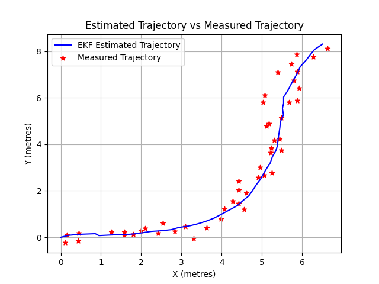
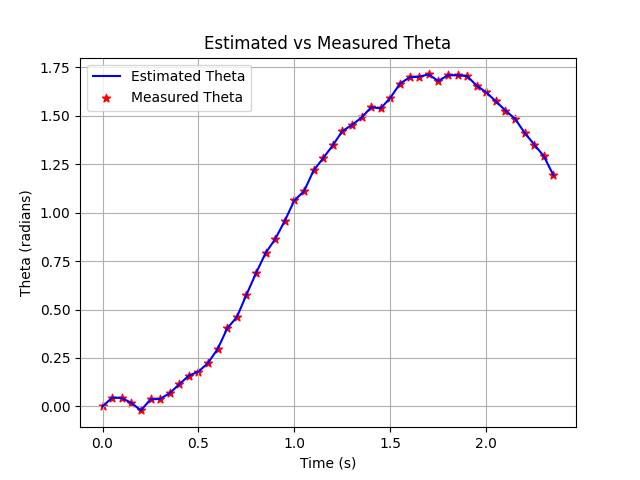
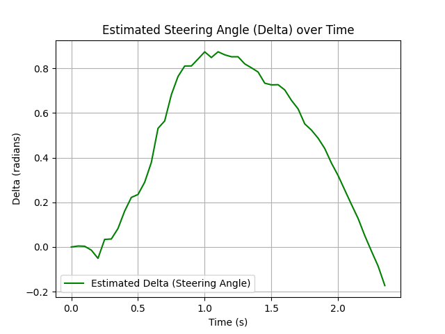

# ED5315 Tutorial - EKF
Implement extended kalman filter to track the motion of a car

## Setup:
Python: 3.6.x

## Instructions:

1. You are asked to track a car. The sensor suite used for tracking has a LIDAR that provides measurements on the 𝑥, 𝑦 (position) and 𝜃 (orientation). You are provided with the measurement
data in the .csv file, this includes 𝑥, 𝑦 (position in m) and 𝜃 (orientation in radians), time at which the measurement was taken (seconds). The standard deviation with pose is +-0.25 m,
and std deviation with orientation is +-0.0873 radians (5°).

2. There is a RADAR in the system that allows for measurement of vehicle speed to be a constant 5 m/s. You are also informed that the wheelbase of the vehicle is 2.5 m.

3. Given the starting pose of the vehicle is position is (0,0 m), orientation is 0 radian, and steering is also at 0 radian.

4. Complete the tracker implimentation in the EKF_class. Sample solution is provided below for you

